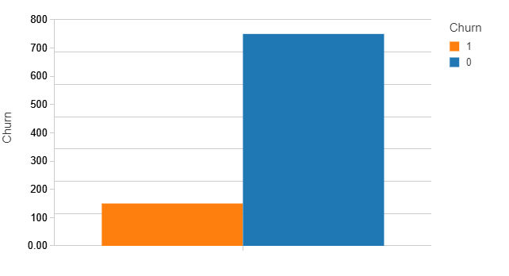
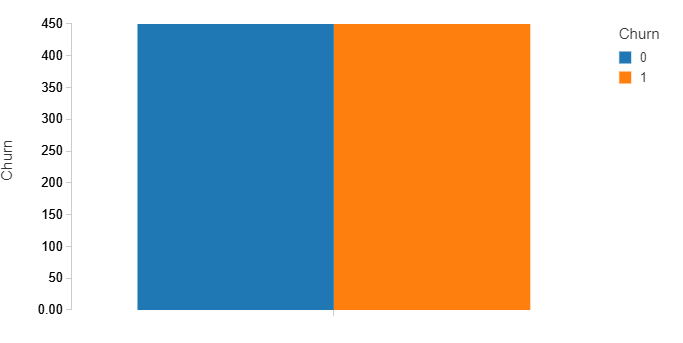
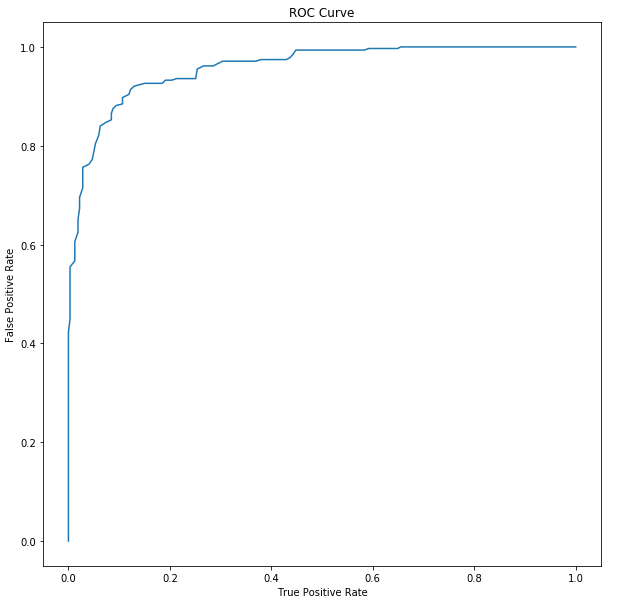

## Customer Churn Detection

The dataset includes different information about customers. The objective is to predict customer churn from the data. The input data is highly imbalanced consisting 150 churn (i.e., churn = 1) and 750 no churn (i.e., churn = 0) customers. Check the customer_churn.csv dataset for details.

• MLlib and pyspark is used to build the model.  
• Feature vectorization is performed to convert the categorical features. 
• Random undersampling is performed to the majority class (i.e., No Churn) and random oversampling is performed to the minority class (i.e., Churn) to balance the class distribution. 
• Logistic regression, Random Forest and Gradient Boosting Tree are applied to the balanced data. 
• The best performance is achieved for the Gradient Boost Tree with AUC (Area Under Curve) = 0.92 
 
## Initial Distribution of the Class (i.e., Churn):

## Distribution after sampling:

## Area Under Curve (AUC):

